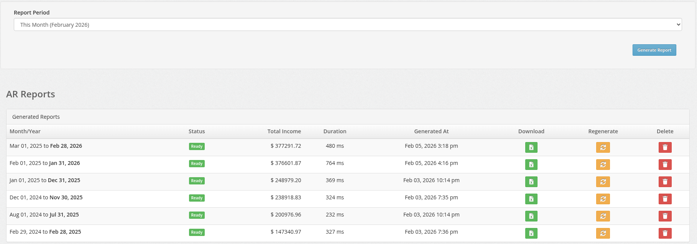
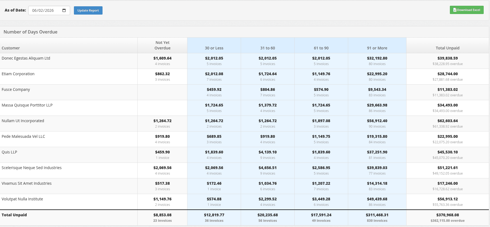

# Reporting - Aged Receivables

Managing cash flow is critical for any trucking business. UTX Freight provides two distinct **Aged Receivables (AR)** reports to help you track outstanding payments from different perspectives: **Business Performance** and **Accounting Compliance**.

## 1. Performance AR Report (Operational)

This report is designed for **Business Health**. It focuses on the last 12 months of activity to give you a complete picture of your recent sales alongside your outstanding collections.

- **Scope:** 12-month period ending on the selected date.
- **Key Feature:** Calculates **Total Income** (Sales) for the period.
- **Best For:** Owners and Managers wanting to see "How much did we make?" and "Who owes us money from recent work?"

### Key Columns

- **All Income:** Total value of invoices generated in the 12-month period (paid and unpaid).
- **AR Buckets:** Outstanding balance categorized by age (30, 60, 90+ days).

---

## 2. Standard Aged Receivables (GAAP)

This report is designed for **Accounting & Audits**. It is a strict, GAAP-compliant snapshot of your Accounts Receivable ledger as of a specific date.

- **Scope:** Historical snapshot (includes all unpaid debts from any time).
- **Key Feature:** Strict aging based on **Due Dates**.
- **Best For:** Accountants, Bookkeepers, and Year-End Audits.

### How it Works

- **Due Date Priority:** Aging is calculated based on the invoice `Due Date`. If an invoice has Net 30 terms, it is not considered "Overdue" until day 31.
- **Historical Accuracy:** It ignores any invoices or payments created _after_ the selected date, ensuring the numbers match your historical books exactly.

---

## Comparison: Which Report Should I Use?

| Feature | Performance Report | Standard AR Report |
| ---- | ---- | ---- |
| **Primary Goal** | Operational Health & Sales | Financial Compliance |
| **Time Period** | Last 12 Months | Snapshot (All Time) |
| **Includes Income?** | **Yes** (Total Sales) | No (Unpaid Only) |
| **Aging Based On** | Invoice Age | **Due Date** (Strict) |
| **Use Case** | "How is business going?" | "Close the books for the month." |

## How to Use

### Generating Reports

1. Navigate to **Reports > Aged Receivables**.
2. Select the **Month** and **Year** you want to analyze.
3. Click **Generate Report** (for Performance) or **Update Report** (for Standard AR).

### Downloading Data

Both reports allow you to export the data to Excel for further analysis.

- Look for the :fontawesome-solid-file-excel: **Download Excel** button on the report page.
- The Excel file will include all columns and totals currently visible on the screen.

### Regenerating Reports

If you need to refresh the data (e.g., after fixing an invoice):

1. Click the **Regenerate** button (Performance Report) or simply click **Update Report** again (Standard AR).
2. **Note:** Regenerating will overwrite any previously saved file for that specific month/year.
