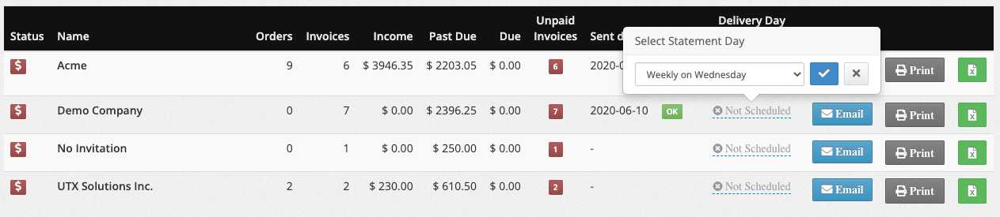
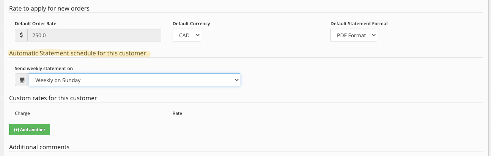

# Automatic Statements

Schedule your customer statements to automatically notify them of unpaid invoices.

## Scheduling

Scheduling of the Statements works by setting the day on which the statement should be delivered to the client.

The mailer will check if there is something to deliver every hour, so if you change the day to **Today** for any customer, the email is automatically sent within the next hour.

**Eg.:** For a customer scheduled for **Friday**, the email will be sent **early in the morning on Friday**. Any updates to this customer should be done the day before it is scheduled to make sure they receive an accurate report.

Once the statement is delivered it will set the **Sent Date** on the **Customer Reports** page to the actual date so you can track the delivery if there was any errors sending the statement.

!!! info "Info"
    The statement email is only sent if the customer balance is **greater than** **0$!**

### Adding a statement schedule to Customers

Adding a statement schedule to a customer will automatically deliver his statement of account. There are **2 ways** this can be accomplished

### Edit the scheduler on the Customer Reports screen

- From the left menu, select :fontawesome-solid-chart-bar: **Report -> Customer Reports**
- Find your **Customer** by name
- Edit the **Delivery Day** column dropdown for this **Customer**
- Click on blue :fontawesome-solid-square-check: to **Save Changes**
- As soon as the changes are saved, the **Next Date** will display when the report will be delivered automatically

!!! warning "Warning"
    Spread the scheduling across multiple days to avoid sending 300-400 emails in a day, ideally you want to keep the number under 100 per day.

### Edit the Customer to set the scheduler

- From the left menu, select :fontawesome-solid-building: **Customers**
- Find your **Customer** by name
- Click on the **Edit customer** button
- On the **Customer Edit** form, select a **Configuration** from the **Send statement on** dropdown
- Click on **Save Changes**

### Scheduler information

The information is available from the **Customer Reports** page and displays statistics about each day and the number of deliveries

