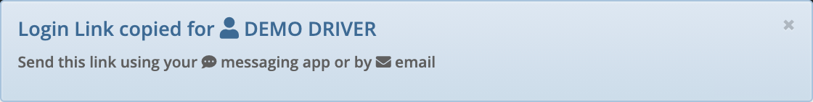

# Dispatch

Dispatching orders is one of the core features of **UTX Freight**.

## Magic Driver Link

Once an order is **Dispatched** for delivery and a **Driver** is selected, a :fontawesome-solid-share-from-square: **Magic Driver Link** shows up beside the name of the driver. By clicking on the icon, a link is copied to the clipboard which can then be pasted to a **Messaging App** or to an **Email** and sent to the Driver.

- The link allows the **Driver** to automatically login to the application and see **all** the orders assigned to him

