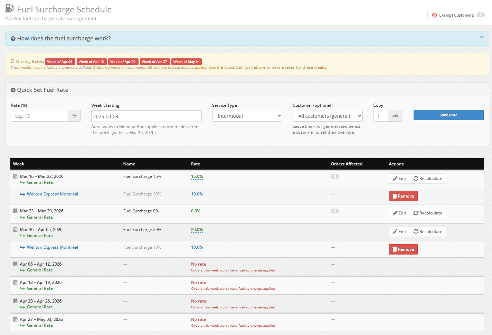
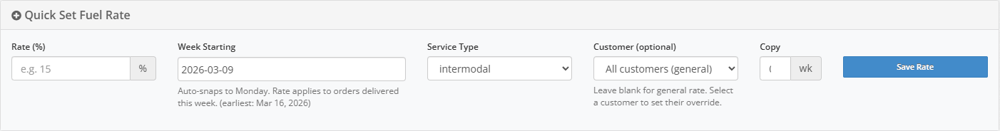
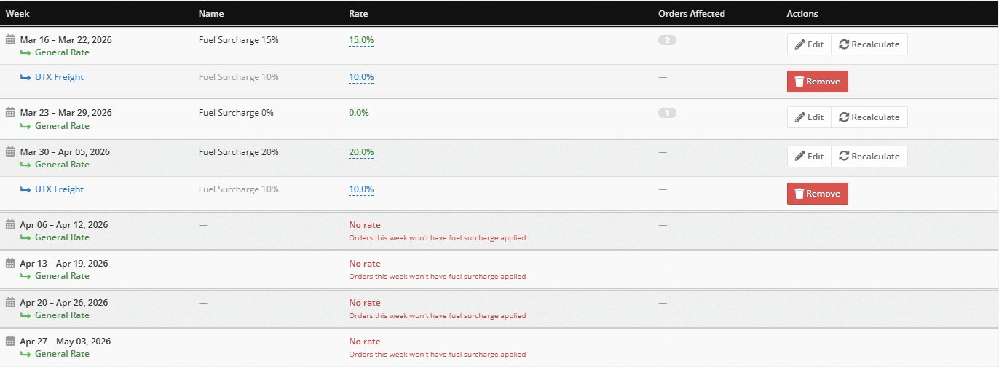
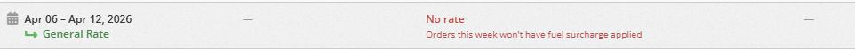
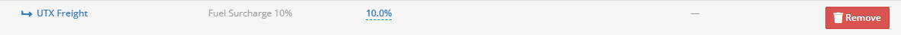
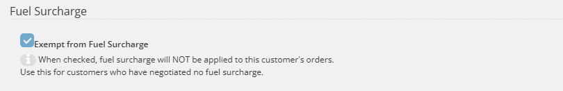
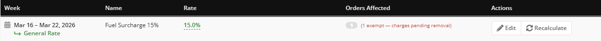
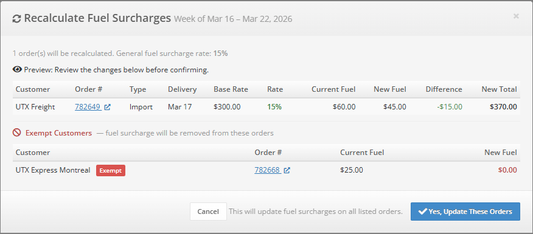
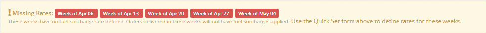

# Fuel Surcharge

Manage monthly fuel surcharge rates that are applied automatically to qualifying orders -- all from one screen.

## :fontawesome-solid-gas-pump: Overview

The **Fuel Surcharge** is a percentage-based charge that UTX Freight applies automatically to your **Import**, **Export**, and **Transfer** orders when auto-compute is enabled. You set the rate once per month, and the system takes care of the rest.

Here is how it works at a glance:

- :fontawesome-solid-calendar-days: **Rates are monthly** -- each rate covers the full calendar month.
- :fontawesome-solid-truck: **The order's delivery date** determines which month's rate applies.
- :fontawesome-solid-building: **Company overrides** let you set a different rate for specific customers.
- :fontawesome-solid-ban: **Exempt customers** skip fuel surcharges entirely.
- :fontawesome-solid-rotate: **Recalculate** updates all open orders in a month with one click.

## :fontawesome-solid-bolt: Quick Start

Already familiar with fuel surcharges? Here is the fastest path to setting a rate:

1. Go to :fontawesome-solid-arrow-right: **Charges** :fontawesome-solid-arrow-right: **Fuel Schedule** from the main menu.
2. Enter a **Rate (%)**, pick the **Month**, and choose a **Service Type**.
3. Click **Save Rate**.

That's it -- the rate is now live for that month. Every qualifying open order delivered in that month will pick up this rate automatically when charges are computed.

!!! tip "Tip"
    Changed a rate after orders were already created? No problem. Just click the **Recalculate** button on that month's row to update all open orders instantly.

---

## :fontawesome-solid-shield-halved: Access & Permissions

The Fuel Schedule page is available to users with one of these roles:

| Role | Access Level |
| ---- | ---- |
| :fontawesome-solid-user-tie: **Manager** | Full access |
| :fontawesome-solid-headset: **Dispatch** (with `manage_rates` permission) | Full access |
| :fontawesome-solid-file-invoice-dollar: **Accountant** | Full access |

**How to get there:**

- :fontawesome-solid-arrow-right: From the left menu, click **Charges**
- :fontawesome-solid-arrow-right: Select **Fuel Schedule**

!!! warning "Can't find Fuel Schedule?"
    If you don't see **Fuel Schedule** under the Charges menu, your user role may not have the required permissions. Ask your administrator to grant the **manage_rates** permission to your dispatch account.

---

## :fontawesome-solid-pencil: Setting a Fuel Rate

Use the **Quick Set** form at the top of the Fuel Schedule page to create or update a rate for any month.

### :fontawesome-solid-rectangle-list: Quick Set Form Fields

| Field | What It Does |
| ---- | ---- |
| :fontawesome-solid-percent: **Rate (%)** | The fuel surcharge percentage. Enter `15` for 15%. |
| :fontawesome-solid-calendar-days: **Month** | The month this rate applies to. |
| :fontawesome-solid-truck: **Service Type** | Which service type this rate covers (e.g., Intermodal). |
| :fontawesome-solid-building: **Customer** | Leave this **blank** for a general rate that applies to everyone. Or select a specific customer to create a company override. |
| :fontawesome-solid-copy: **Copy (mo)** | Number of extra months to copy the same rate forward (0 to 12). Great for setting rates several months in advance. |

### Step-by-step: Create a new monthly rate

1. :fontawesome-solid-arrow-right: Navigate to **Charges** :fontawesome-solid-arrow-right: **Fuel Schedule**.
2. :fontawesome-solid-percent: Enter the **Rate (%)** -- for example, `15` for a 15% surcharge.
3. :fontawesome-solid-calendar-days: Pick the **Month** from the dropdown.
4. :fontawesome-solid-truck: Choose the **Service Type** from the dropdown.
5. :fontawesome-solid-building: Leave **Customer** blank if this is a general rate for all customers.
6. :fontawesome-solid-copy: Optionally enter a number in **Copy (mo)** to repeat this rate for multiple future months.
7. :fontawesome-solid-circle-check: Click **Save Rate**.

If a rate already exists for that month and customer combination, it is updated with the new value.

!!! tip "Time Saver"
    Use the **Copy (mo)** field to save time! If your fuel rate stays the same for the next 4 months, enter `4` and all four months are set in one shot.

### :fontawesome-solid-calculator: How the Fuel Amount Is Calculated

The formula is straightforward:

!!! info "Info"
    Base Rate x Fuel Rate % = Fuel Surcharge Amount

**Example:** An order has a base rate of **$1,000** and the fuel rate for that month is **15%**.

- $1,000 x 15% = **$150.00** fuel surcharge

The amount is always rounded to the nearest cent.

!!! info "Important"
    The fuel surcharge is calculated based on the **order's delivery date**, not the date the order was created. If you move an order's delivery date to a different month, the fuel rate for the new month applies.

---

## :fontawesome-solid-table: Understanding the Schedule Table

The schedule table is the heart of the Fuel Schedule page. It shows every month's fuel rate at a glance, organized chronologically with clear visual cues so you can scan it quickly.

### :fontawesome-solid-palette: Color Guide -- What the Colors Mean

The schedule table uses a **color system** to help you instantly understand what you are looking at. This is one of the most important things to learn:

#### :fontawesome-solid-circle:{ .text-success } Green -- General Rate

The **green row** labeled **"General Rate"** is the default fuel rate for **all customers** that month. If a customer does not have a custom override, this is the rate that applies to their orders.

#### :fontawesome-solid-circle:{ .text-primary } Blue -- Custom Company Rate

A **blue row** with a company name means that specific customer has a **custom rate override** for that month. This custom rate takes priority over the green general rate.

#### :fontawesome-solid-circle:{ .text-danger } Red -- Attention Needed

Red text anywhere in the table means something needs your attention:

- **"charges pending removal"** -- An exempt customer still has fuel charges on open orders. You need to recalculate.
- **"No rate"** -- No rate is defined for that month. Orders delivered that month will **not** have fuel surcharge applied.

### :fontawesome-solid-circle-info: Other Visual Indicators

- :fontawesome-solid-tag: **"Current" label** -- A blue badge marks the current month so you always know where you are.
- :fontawesome-solid-eye-slash: **Faded rows** -- Past months appear faded. Their rates are locked and cannot be edited.
- :fontawesome-solid-grip-lines: **Double borders** -- A thick border separates each month so you can scan rows quickly without losing your place.

### :fontawesome-solid-hashtag: Orders Affected Column

Each row shows the count of **open orders** that use that month's rate. This tells you how many orders will be impacted if you change the rate or click Recalculate.

If any of those orders belong to **exempt customers** who still have fuel charges, the count appears in **red** as a reminder to recalculate.

---

## :fontawesome-solid-building: Custom Company Rates

Need to charge a different fuel rate for a specific customer? You can create a **custom company rate** that overrides the general rate for that month.

### Step-by-step: Set a custom rate for a customer

1. :fontawesome-solid-arrow-right: Go to **Charges** :fontawesome-solid-arrow-right: **Fuel Schedule**.
2. :fontawesome-solid-building: In the **Quick Set** form, select the customer from the **Customer** dropdown.
3. :fontawesome-solid-percent: Enter the custom **Rate (%)**.
4. :fontawesome-solid-calendar-days: Pick the **Month**.
5. :fontawesome-solid-truck: Choose the **Service Type**.
6. :fontawesome-solid-circle-check: Click **Save Rate**.

The override appears **indented** below the general rate row for that month, with the company name displayed in **blue**. Whenever this customer's orders are created or updated, the system uses their custom rate instead of the general rate.

### :fontawesome-solid-trash: Removing a Custom Rate

To remove a custom company rate, click the red **Remove** button on the override row. The customer will then fall back to the green general rate for that month.

!!! warning "Don't forget to recalculate"
    After removing a custom rate, remember to click **Recalculate** on that month so open orders for that customer are updated to use the general rate.

---

## :fontawesome-solid-ban: Exempting a Customer from Fuel Surcharges

Some customers may have contractual agreements that exclude fuel surcharges entirely. You can mark these customers as **exempt**.

### Step-by-step: Exempt a customer

1. :fontawesome-solid-arrow-right: From the left menu, select :fontawesome-solid-building: **Customers**.
2. :fontawesome-solid-magnifying-glass: Find the customer by name.
3. :fontawesome-solid-pencil: Click the **Edit** button on that customer.
4. :fontawesome-solid-gas-pump: Scroll down to the **Fuel Surcharge** section.
5. :fontawesome-solid-square-check: Check the box labeled **Exempt from Fuel Surcharge**.
6. :fontawesome-solid-circle-check: Click **Save**.

After saving, if the customer has **open orders** that already carry fuel charges, you will see a **yellow warning banner** on the Customers page.

!!! danger "Critical: Recalculate After Exempting"
    Exempting a customer does **not** automatically remove fuel charges from their existing open orders. You **must** go to the Fuel Schedule and click **Recalculate** on the affected month(s) to remove those charges. Until you do, those stale charges remain on the orders.

### :fontawesome-solid-eye: Viewing All Exempt Customers

Want to see every customer who is currently exempt? Click the **Exempt Customers** button in the top-right corner of the Fuel Schedule page.

The badge on the button shows the total count of exempt customers at a glance.

---

## :fontawesome-solid-triangle-exclamation: Stale Charges on Exempt Customers

When a customer is exempted but their open orders still carry fuel charges, those charges are considered **stale**. This is the most common issue dispatchers run into, so here is exactly what to look for.

The schedule table flags stale charges with a **red indicator** on the affected month's row:

!!! info "Info"
    (3 exempt -- charges pending removal)

This tells you that **3 orders** for exempt customers in that month still have fuel charges that need to be removed.

**How to fix it:** Click the :fontawesome-solid-rotate: **Recalculate** button on that month's row. The stale charges will be cleared to $0 for all exempt customers.

!!! warning "Best Practice"
    Check the Fuel Schedule page regularly -- especially after exempting customers. Stale charges are easy to miss if you do not look for the red indicators.

---

## :fontawesome-solid-rotate: Recalculating Fuel Charges

The **Recalculate** button is your tool for updating all open orders in a given month with the current fuel rate. It appears on **current and future months** whenever there are open orders or exempt charges to process.

### :fontawesome-solid-list-ol: Step-by-step: Recalculate a month

1. :fontawesome-solid-arrow-right: On the Fuel Schedule page, find the month you want to update.
2. :fontawesome-solid-rotate: Click the **Recalculate** button on that month's row.
3. :fontawesome-solid-eye: A **preview modal** opens showing every affected order, its **current fuel amount**, and the **new amount** after recalculation.
4. :fontawesome-solid-ban: If any exempt customers have stale charges, they appear in a separate **Exempt Orders** section at the bottom of the modal. These orders will have their fuel charges set to **$0**.

5. :fontawesome-solid-circle-check: Review everything carefully, then click **Confirm** to apply all changes.

All open orders for that month are updated in one step. **Completed and invoiced orders are never modified** -- they are safe.

!!! info "Quick Access"
    You can click on any **order number** in the Recalculate modal to open that order in a new tab. This is helpful if you want to review an order before confirming the recalculation.

!!! warning "Past Months Are Locked"
    Past months do **not** show a Recalculate button. If you need to fix charges on a past month, you must adjust those orders individually from the Orders page.

---

## :fontawesome-solid-circle-exclamation: Missing Rates Warning

If any upcoming months do not have a fuel rate defined, a **red warning banner** appears at the top of the Fuel Schedule page listing the affected months.

Orders delivered in months without a rate will **not** have any fuel surcharge applied. Use the Quick Set form to define rates for those months as soon as possible.

!!! tip "Stay Ahead"
    Set your fuel rates at least **2-3 months in advance** to avoid missing rates on new orders. Use the **Copy (mo)** field in the Quick Set form to set multiple months at once.

---

## :fontawesome-solid-clock-rotate-left: Legacy Weekly Rates

Before the monthly fuel schedule was introduced, fuel rates were set on a **weekly** basis (Monday through Sunday). If your account has been around for a while, you may still see these older weekly rates.

Here is what you need to know:

- :fontawesome-solid-calendar-days: Orders delivered **before the monthly cutoff date** still use the legacy weekly rates.
- :fontawesome-solid-circle-info: The cutoff date is displayed in a **blue info banner** at the top of the Fuel Schedule page.
- :fontawesome-solid-table: Legacy weekly rates appear in a **separate table** at the bottom of the page.
- :fontawesome-solid-pencil: You can still **edit** legacy weekly rates if you need to make adjustments.

!!! info "Going Forward"
    All new rates should be set using the monthly system. The legacy weekly table is only for historical orders that predate the monthly cutoff.

---

## :fontawesome-solid-circle-question: FAQ / Troubleshooting

### :fontawesome-solid-ban: Customer was exempted but still has fuel charges

!!! info "Solution"
    Exempting a customer does not automatically remove existing fuel charges from their open orders. Go to **Charges > Fuel Schedule**, find the affected month, and click **Recalculate** to remove the stale charges. The preview modal will show those orders in the **Exempt Orders** section with their fuel set to $0.

### :fontawesome-solid-lock: No Recalculate button for a past month

!!! info "Solution"
    Past months are locked and cannot be recalculated. The **Recalculate** button only appears on the **current month** and **future months**. To fix fuel charges on past-month orders, you need to edit those orders individually from the Orders page.

### :fontawesome-solid-rotate: Rate was changed but orders still show the old amount

!!! info "Solution"
    Changing a fuel rate does **not** automatically update existing orders. Click **Recalculate** for that month to apply the new rate to all open orders. The preview modal will show you the old and new amounts before you confirm.

### :fontawesome-solid-building: Customer has a custom rate but orders use the general rate

!!! info "Solution"
    Double-check that the custom rate is set for the correct **month** and **service type**. The order's **delivery date** determines which month's rate applies, and the **service type** must match exactly. If the rate was added after the orders were created, click **Recalculate** to apply it.

### :fontawesome-solid-lightbulb: Tips for managing fuel surcharges effectively

!!! tip "Best Practices"
    **Set rates early.** Use the Copy (mo) field to set rates 4-8 months in advance.

    **Check for red indicators.** Red text on the schedule table always means something needs your attention.

    **Recalculate after changes.** Any time you change a rate, exempt a customer, or remove a custom override, click Recalculate on the affected months.

    **Review the preview.** Always check the Recalculate preview modal before confirming -- it shows you exactly what will change.
