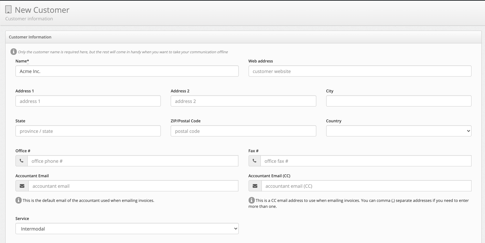
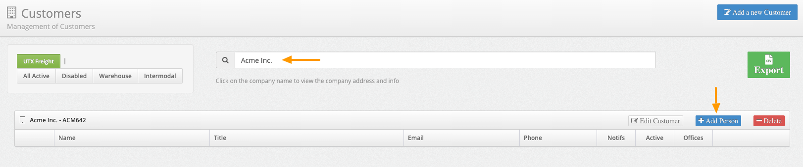
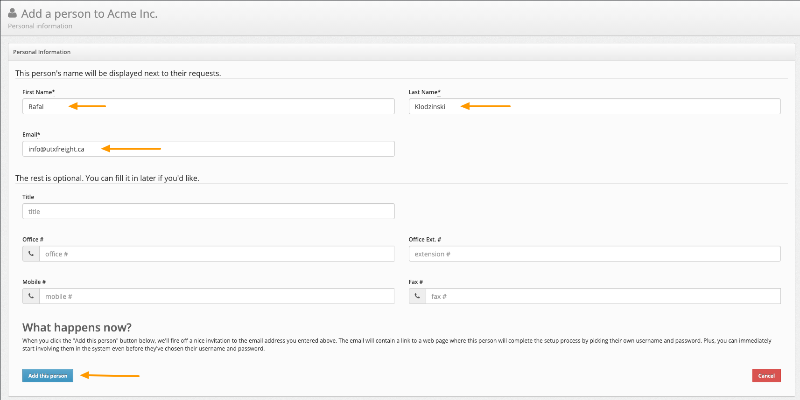
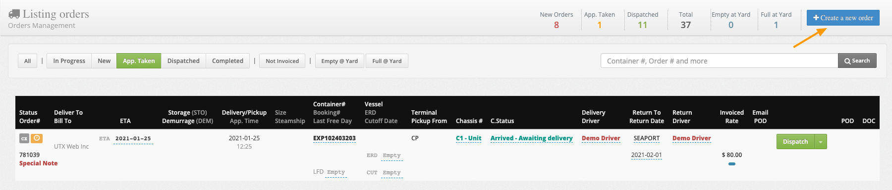
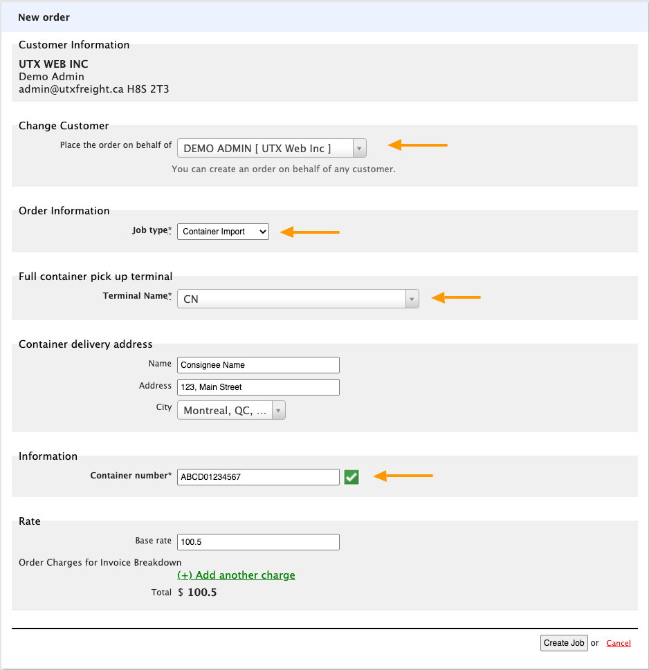

# Getting Started

This section explains how to get up and running with UTX Freight highlighting the basic needs to create your first **Order.**

## Quick steps

### Create your first customer

All the orders in UTX Freight are placed on behalf of a contact :fontawesome-solid-user: **Person** from a :fontawesome-solid-building: **Customers** list, therefore the first step is to create the Customer company and invite a contact.

- From the left menu, select :fontawesome-solid-building: **Customers**
- Click on the **Add a new customer** button on the top right
- Start by entering the **company name** which is the only required field
- Click on **Save Changes**

### Add a contact person

Once you have your first :fontawesome-solid-building: **Customer** created, you need to invite a contact :fontawesome-solid-user: **Person** for this Customer. Orders will be associated with those contacts and they will be the ones receiving notifications.

- From the left menu, select :fontawesome-solid-building: **Customers**
- Using the top filter, find your Customer by typing the company name
- Once the results show up, click on :fontawesome-solid-plus: **Add Person**

!!! warning "An invitation email is sent to new Users"
    When you add a new Person to the system, they will automatically receive an invitation email and they will be able to add new **Order**. You can skip this step by entering a _dummy_ email address, using for example **customer_name+1@utxfreight.ca**. You can always change this later.

- Fill up the basic user information such as **First name, Last name and Email** and you are ready to go.

### Create your first Order

Once you enter your Customer and a contact Person, you can move ahead and create your first Order.

- From the left menu, select :fontawesome-solid-truck: **Orders**
- Click on :fontawesome-solid-plus: **Create a new Order**

The create new order has many options, let's create a **Container Import** to start, the following fields are required and must be supplied:

- Customer
- Order Type
- Pickup Terminal
- Delivery Address
- Container Number

## Next Steps

Once the information is entered and the order submitted you will be ready to proceed with the next steps.

- :fontawesome-solid-clock: **Scheduling an appointment**
- :fontawesome-solid-location-arrow: **Tracing the shipment**
- :fontawesome-solid-user-clock: **Assigning Drivers**
- :fontawesome-solid-truck: **Dispatching the order**
- :fontawesome-solid-signature: **Delivering and accepting a signature**
- :fontawesome-solid-check-double: **Completing the order**
- :fontawesome-solid-file-invoice: **Invoicing**
- :fontawesome-solid-dollar-sign: **Getting paid**
