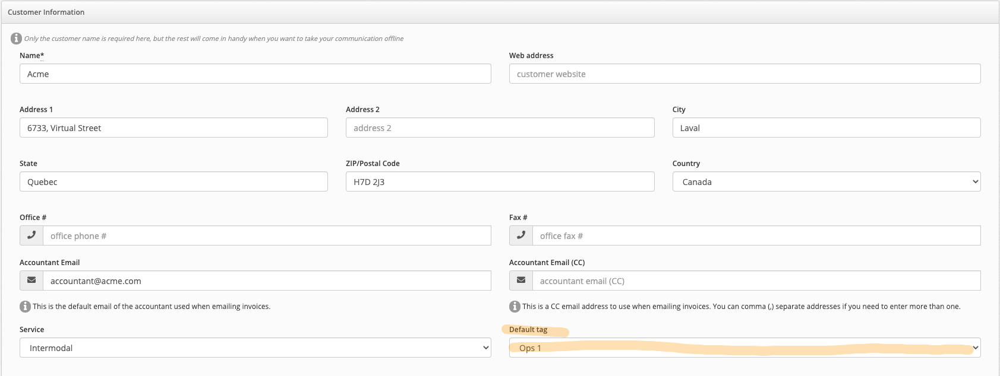
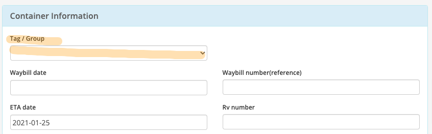
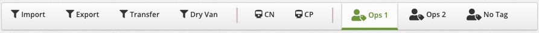

# Order Tagging

Organize your orders by adding a **Tag** to them to quickly assign them to each dispatcher.

## Tagging

The concept of tagging is very simple, add a custom **Tag** to each order so that you can quickly organize your workflow.

### Adding default tags to Customers

Adding a default tag to a customer will automatically add this tag to any new order created for this customer. This can be accomplished with the following steps:

- From the left menu, select :fontawesome-solid-building: **Customers**
- Find your **Customer** by name
- Click on the **Edit customer** button
- On the **Customer Edit** form, select a **Tag** from the **Default Tag** dropdown
- Click on **Save Changes**

### Changing or removing a tag

The tag can be changed or removed from the Order at any time using the following steps

- From the **Orders** listing, click on the **Action Button**
- Select **Quick Edit**
- Under the **Container Information** section, change or remove the **Tag / Group** value

### Filtering orders by Tag name

- Filtering by Tag is available on the **Orders** and **Dispatch** pages
- On the **Dispatch** page, simply click on the **Tag** name to only see the associated orders
- The filter includes all the available **Tags** as well as untagged orders filter

